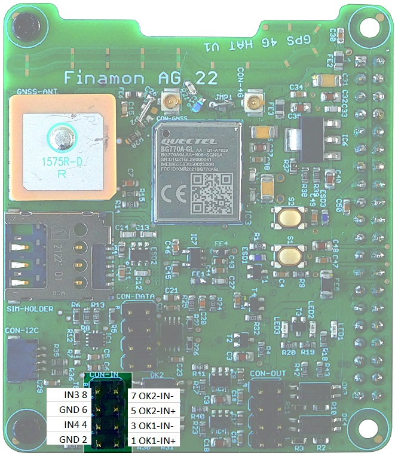
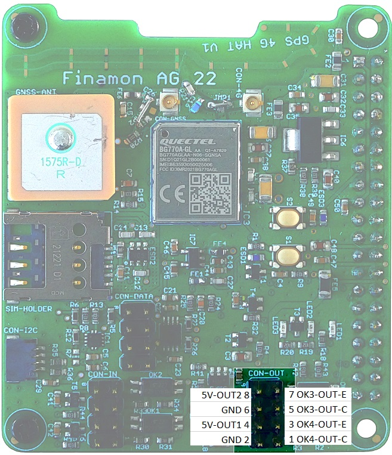
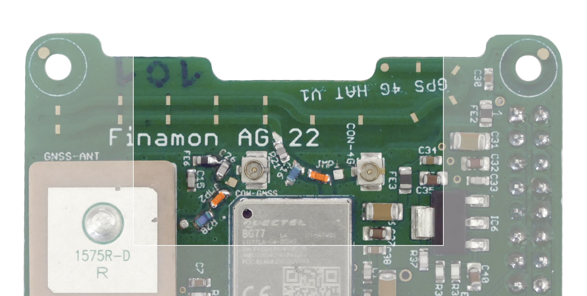
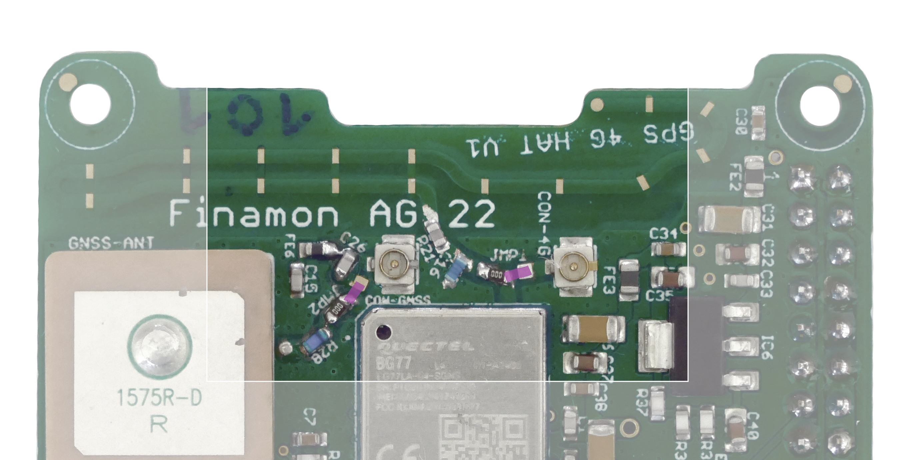

# gps4ghat
**GPS_4G_HAT_BG77X** 

### Library

Python drivers for Finamon GPS 4G shield onboard devices and peripheral interfaces
- Quectel BG77/BG770 4G Modem
- Accelerometer MC3419/MC3479
- Other shield HW parts: inputs/outputs, button, LED
  
### Examples

Basic examples showing how to work with Finamon GPS 4G shield onboard devices using Python.
- demo_echo.py
- demo_geofences.py
- demo_GPS_4G_HAT.py
- demo_mqtt.py 

### Prerequisites

__Raspberry Pi Config__

In your Raspberry Pi configuration within the _Interfaces_ section, please make sure that

1. I2C is **enabled**
2. Serial Port is **enabled**
3. Serial Console is **disabled**

__Global setup__

If you prefer to setup your projects using global package installations, please take a look at the prerequisites below.

> With newer versions of Python you might experience the message *error: externally-managed-environment* 
  In this case try using pip's argument `--break-system-packages`     		
  or add the following lines to ~/.config/pip/pip.conf: 
  `[global]` 
  `break-system-packages = true`

- To be able to parse NMEA messages install package `pynmea2`:\
  `pip install pynmea2`
  
- For access to SIM card account information install `python-dotenv`:\
  `pip install python-dotenv`

__Virtual Enivironment__

If you prefer to setup your projects using virtual environments, the necessary steps to be able to run the examples are:

1. Download or clone the repository (see section below)
2. Open the termianl and change into the repository folder
3. Even using the virtual environment the project needs access to a global package to work with GPIOs
    - Run `sudo apt update && sudo apt install python3-libgpiod`
4. Now you can create the virtual environment `python3 -m venv .venv --system-site-packages`
    - The parameter `--system-site-packages` allows to access packages from outside of the virtual environment
5. Activate the environment via `source .venv/bin/activate`
    - (use the command `deactivate` to leave the virtual environment)
7. Install the dependencies to run the demo scripts `python3 -m pip install pynmea2 python-dotenv pyserial smbus`
8. Now you can continue with the installation steps in the following sections to install the GPS 4G HAT library and execute the demo scripts

### Installation
- Clone git repository https://github.com/finamon-de/gps-4g-hat-library

- Change directory\
  `cd gps-4g-hat-library/gps4ghat/dist/`

- Install `gps4ghat` python package\
  `pip install gps4ghat-0.1.0-py3-none-any.whl`

### Getting started
- Change directory to `gps-4g-hat-library` 

- Copy example.env file to .env file and edit SIM account data:\
  `CONTEXT_APN`\
  `CONTEXT_USERNAME`\
  `CONTEXT_PASSWORD`\
  
- Start examples\
  `python examples/demo_xxxx.py`

### Notes

- By default the GPS 4G HAT is configured to use the **internal/onboard** GSM antenna and the **external** GNSS RF antenna (that is part of the deliverables). You can ensure this configuration by having a look at the resistors close to antenna connectors.

  
